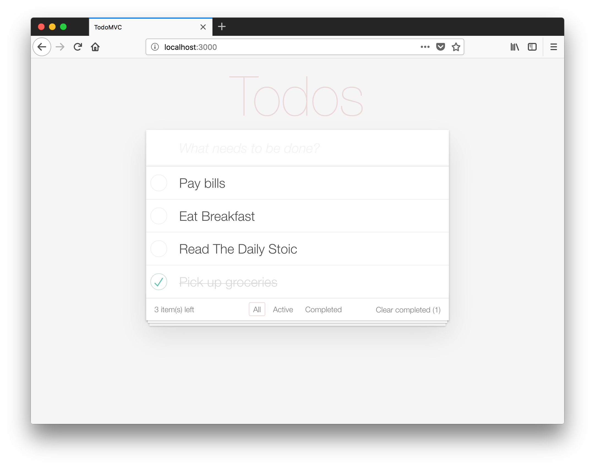

todomvc-react-ssr
===
Yet another [TodoMVC](http://todomvc.com) implementation (YATMI) using express to render service side React. Storage is provided via LocalStorage.

Usage:

```
npm i
npm run start-dev
```


